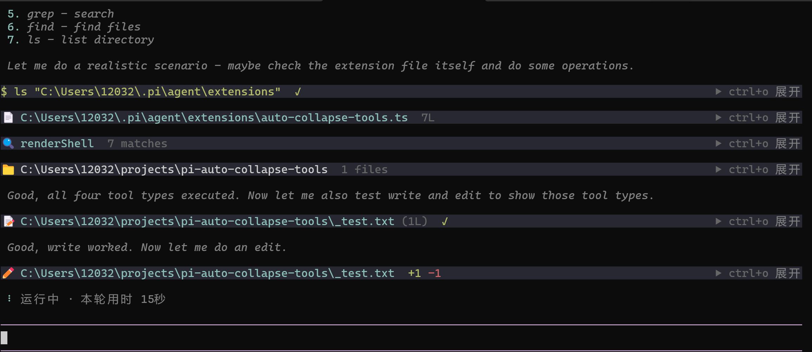

# pi-slim-tools

将 pi 的 7 个内置工具（bash / read / edit / write / grep / find / ls）输出压缩为**单行摘要**，终端不再被刷屏。

按 **Ctrl+O** 展开查看完整输出。

## 效果



## 安装

```bash
pi install github:lns567/pi-slim-tools
```

## 手动安装

复制到 `~/.pi/agent/extensions/` 然后 `/reload`。

## License

MIT
